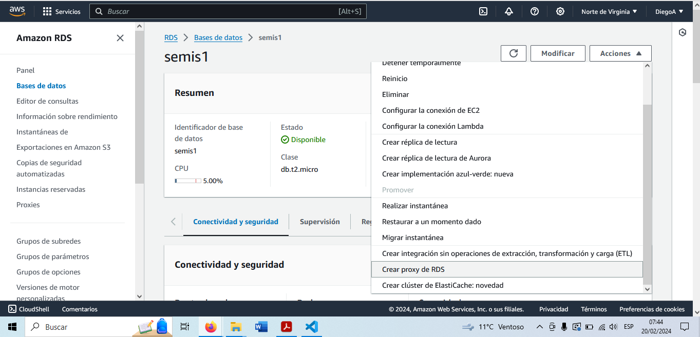
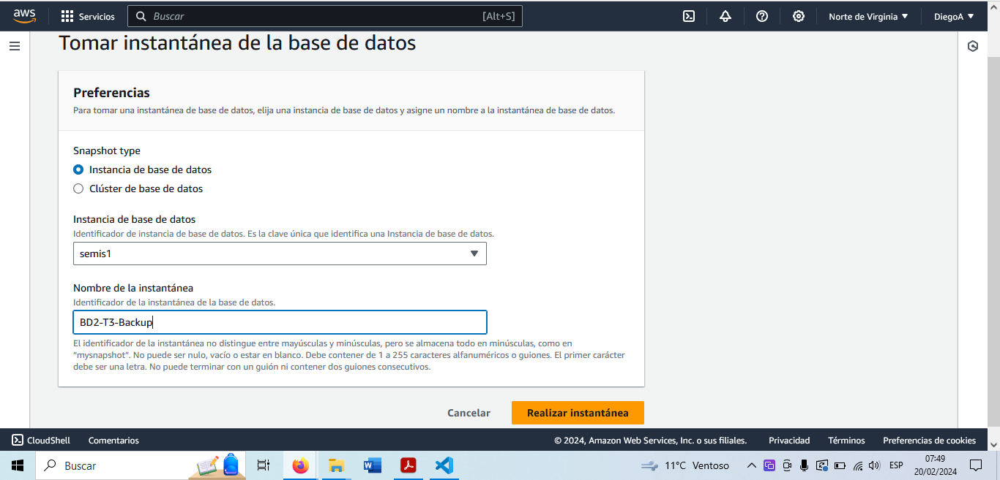
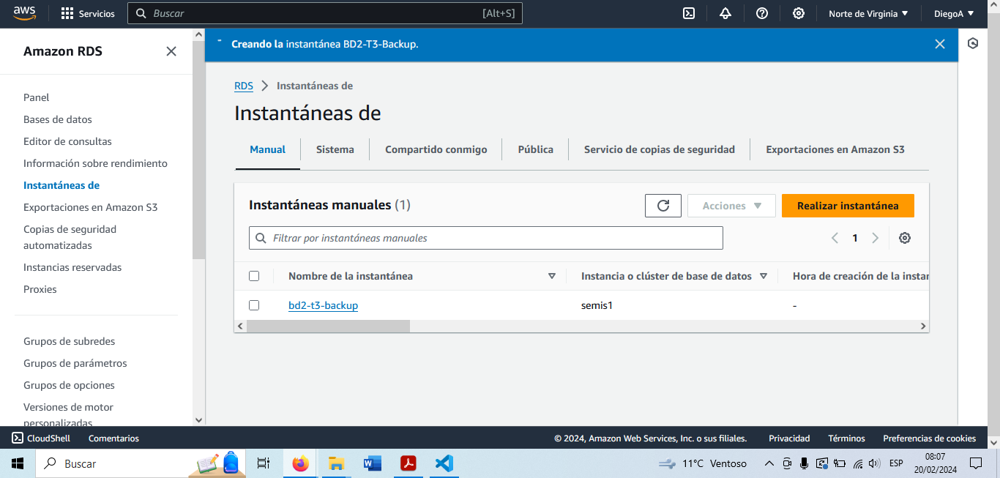

# BD2-202003892-T2
* Se utilizara la BD que se utiliza para realizar la practica 1 de Seminario de Sistemas 1.

* Se debe presionar el botón de *Acciones* para desplegar el menú de acciones. 
* Se debe presionar la opción *Realizar instantánea*

* En la pestaña que abrira se debe seleccionar si se quiere una instancia en especifico o un cluster (Para este caso se debe seleccionar Instancia de base de datos).
* Se le debe dar un nombre al backup.

* Una vez ingresados los datos se debe presionar el boton *Realizar instancia*.

* Para ver el backup se debe ir a la sección de **Instancias de**
